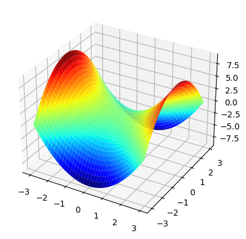
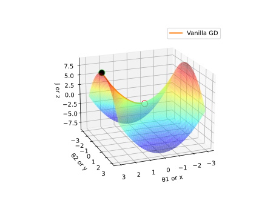
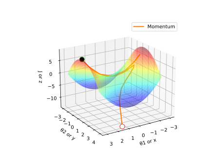
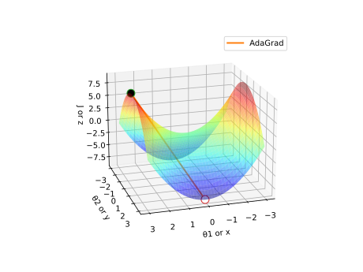
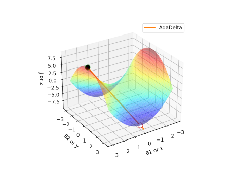
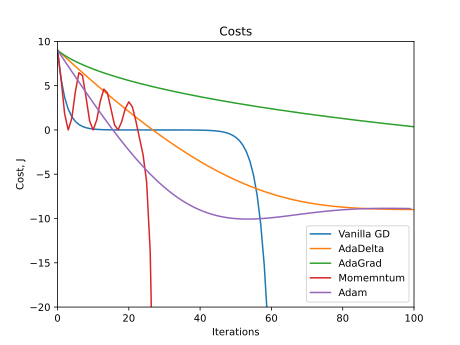

# DeepLearning-Optimizers
Visualization of popular Deep Learning optimizers built upon Gradient Descent.

## Cost Function
$z = x^2 - y^2$ , or, $J = \theta_1^2 - \theta_2^2$

### Vanilla Gradient Descent

### Momentum

### AdaGrad

### AdaDelta

## Costs Comparison
